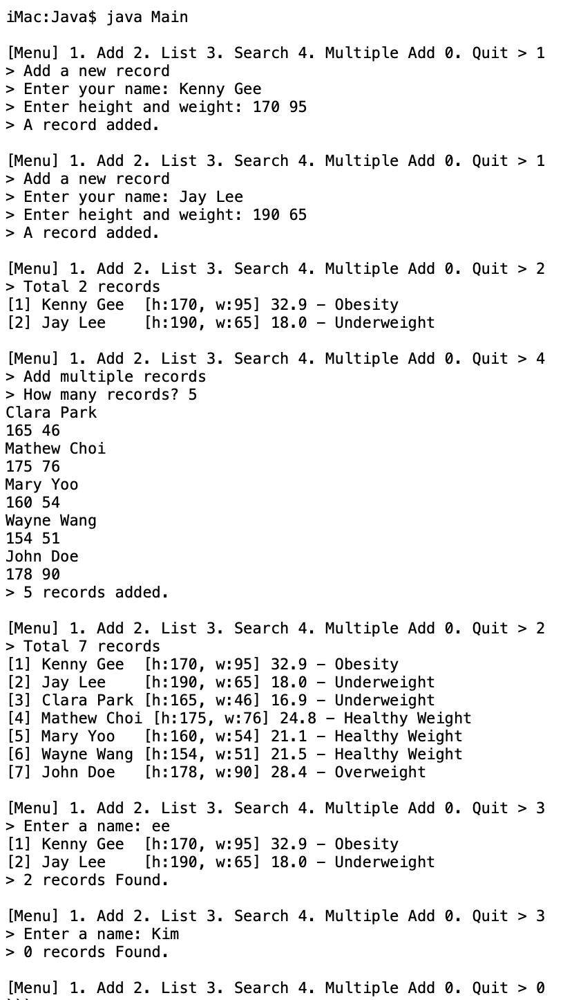
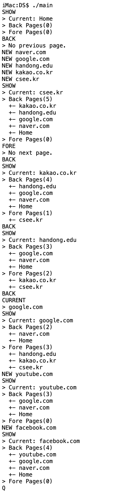

# 2025 Programming Studio Coding Test 1
- 아래 제시된 Site 및 이전에 제출한 자신의 연습문제 소스만 참고 가능합니다.
>- Google에서 관련 키워드를 통해 검색된 Blog 글을 단순히 참고하기
>- [W3 Schools Java](https://www.w3schools.com/java/default.asp)
>- [Java Document](https://docs.oracle.com/en/java/javase/24/docs/api/index.html)
>- [W3 Schools C++](https://www.w3schools.com/cpp/default.asp)
>- [C++ Reference](https://modoocode.com/category/C++%20Reference)
- 어떤 형태의 AI Tool 이라도 사용할 수 없으며, 사람과의 온/오프라인 대화, 메시징, 이메일 등은 불가합니다.

- 모든 코드 제출물 최상단에 다음과 같이 학번과 이름, 아너코드 선언을 주석으로 포함해야 합니다.
```
// 이름: (이름)
// 학번: (학번)
// 아너코드: 나 OOO은(는) 하나님과 사람 앞에서 정직하고 성실하게 코딩 테스트를 수행하겠습니다.
```

## Java program
- 프로그램 주제: 비만도 관리
- 제시된 소스코드를 충분히 분석하고, 아래 실행화면을 참고하여 Main.java 내에 Main 클래스의 다음 메소드를 구현하면서 프로그램을 완성하시오.
- 구현할 메소드의 동작 설명
```
public int addItems()
// 여러 명의 비만도 관리를 위한 데이터(이름, 신장, 체중)를 한꺼번에 입력받는다.

public void searchItem(){
// 현재 관리 중인 비만도 관리 데이터에서 입력받은 단어가 이름에 포함된 데이터를 출력한다.
```
- 완성된 프로그램 소스코드, 화면캡쳐 이미지, 수정한 README.md 파일을 github classroom에 push 하시오
- 완성된 프로그램의 실행화면을 적절하게 캡쳐하여 captures 디렉토리에 올린 후, README.md 에서 확인할 수 있도록 간단한 설명과 이미지 파일 이름을 넣으시오. (아래 샘플용 입력데이터를 참고하시오)
- Test를 수행하면서 느낀 소감을 README.md에 넣으시오.

## Java program sample screen

### Sample data for input
```
Kenny Gee
170 95
Jay Lee
190 65
Clara Park
165 46
Mathew Choi
175 76
Mary Yoo
160 54
Wayne Wang
154 51
John Doe
178 90
```
## DS/C++ program
- 프로그램 주제: 웹사이트 방문기록 관리
>- 웹사이트를 방문하면서 현재 URL을 기준으로 이전(뒤로가기) 페이지들은 back_pages 스택에, 이후(앞으로가기) 페이지들은 fore_pages 스택에 보관하면서 방문기록을 관리하는 프로그램을 작성한다. 
- Windows 사용자는 반드시 Makefile 내에 EXEC 매크로를 main.exe로 변경하기 바랍니다.
- 제시된 소스코드를 충분히 분석하고, 아래 실행화면을 참고하여 main.cpp 내에 main() 코드를 수정하고, MyStringStack.cpp 내에 MyStringStack 클래스 멤버인 printAll() 함수를 구현하면서 프로그램을 완성하시오.
- 구현할 명령어(메뉴)의 기능 설명
>- NEW new_url: 현재 URL을 back_pages에 넣고, new_url로 대체한다. 그리고 fore_pages의 내용을 모두 제거한다.
>- BACK: 현재 URL을 fore_pages에 넣고, back_pages에서 꺼낸 URL을 현재 URL로 대체한다. 단, back_pages에 보관 중인 URL이 없으면 "> No previous page." 메시지를 표시한다.  
>- FORE: 현재 URL을 back_pages에 넣고, fore_pages에서 꺼낸 URL을 현재 URL로 대체한다. 단, fore_pages에 보관 중인 URL이 없으면 "> No next page." 메시지를 표시한다.  
- 구현할 함수의 동작 설명
```
void printAll() const;
// 아래 실행화면과 같은 방식으로 현재 스택에 보관 중인 URL을 출력한다.
```
- 완성된 프로그램 소스코드, 화면캡쳐 이미지, 수정한 README.md 파일을 github classroom에 push 하시오
- 완성된 프로그램의 실행화면을 적절하게 캡쳐하여 captures 디렉토리에 올린 후, README.md 에서 확인할 수 있도록 간단한 설명과 이미지 파일 이름을 넣으시오. (아래 샘플용 입력데이터를 참고하시오)
- Test를 수행하면서 느낀 소감을 README.md에 넣으시오.

## DS/C++ program sample screen

